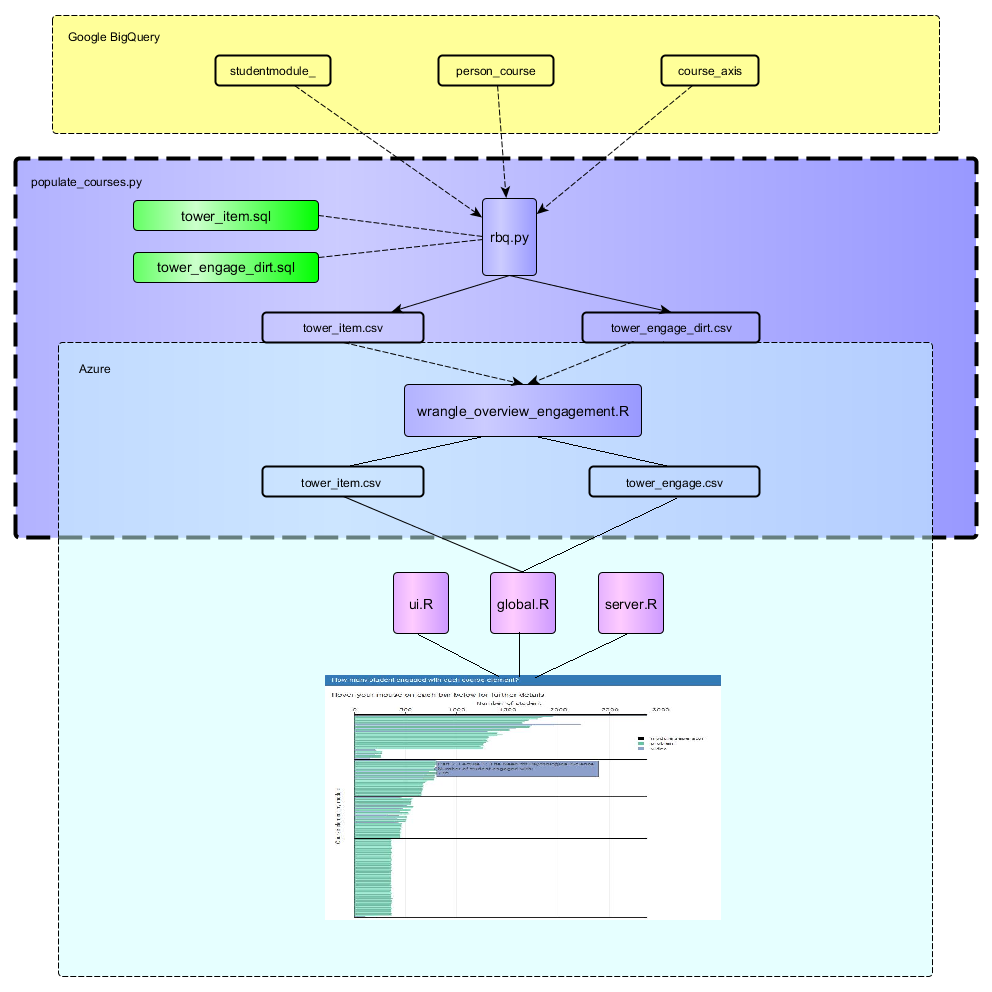
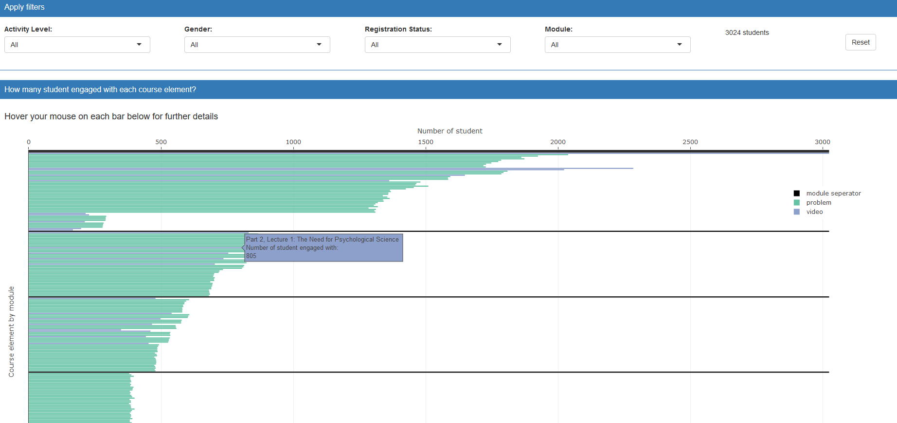

# Engagement Overview Dashboard Overview

## Data Cleaning Pipeline

## Visualization Reasoning and Caveats

Since videos and problems are the two basic components in edX MOOC courses, instructors can get a general picture concerning student engagement by seeing how many students engaged with each video/problem. 

As a result, we designed this the plot below to show the relationship between course structure and engagement. Each horizontal bar is a course element (video, problem or module separator). These bars are arranged in such a way that matches its occurrence within the course. The length of each bar indicates how many student engaged with this course element.

This visualization aims to help instructors finish four types of tasks:

- Obtain an intuitive sense about course structure. For example, instructors can explore which module are relatively excessive and contain an abnormally high amount of course elements. 

- Identify where students drop out of the course.

- Locate videos and problems throughout the course by using module filtering

- Explore trends amongst the learners by applying different filtering options. For example, instructors may explore engagement differences between auditing and verified students.

