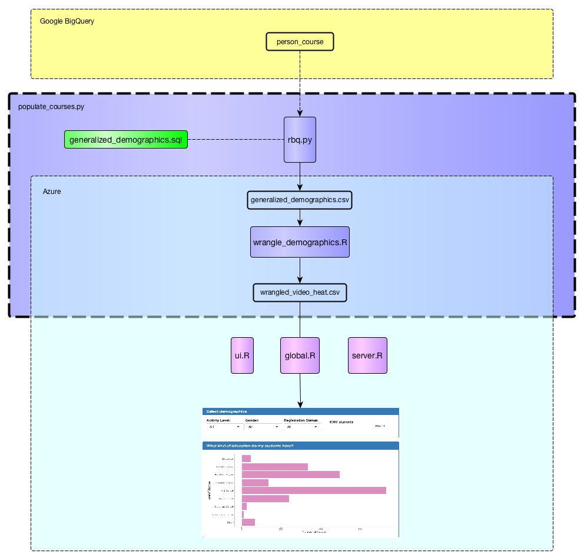
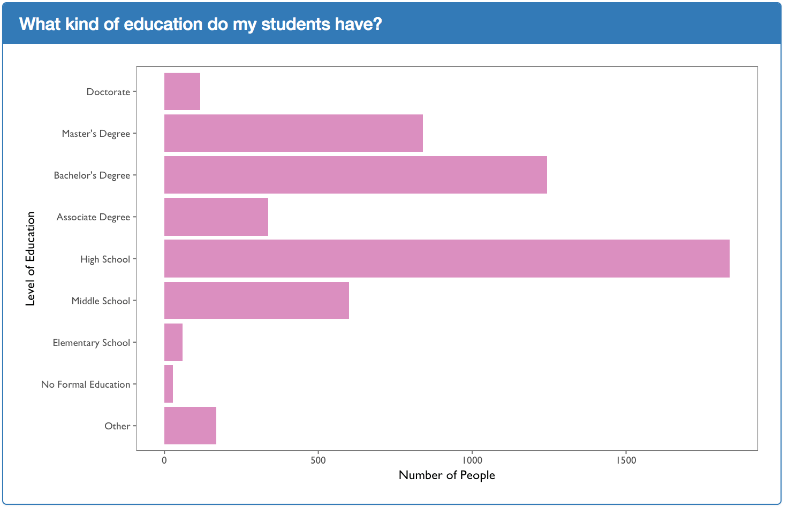
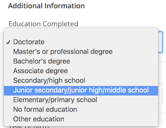
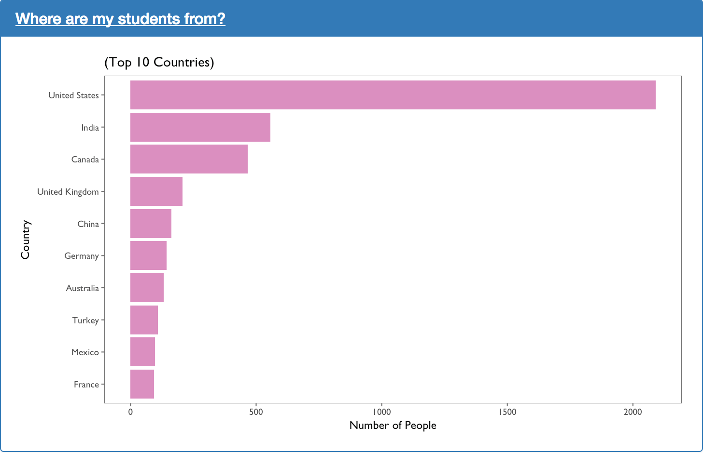
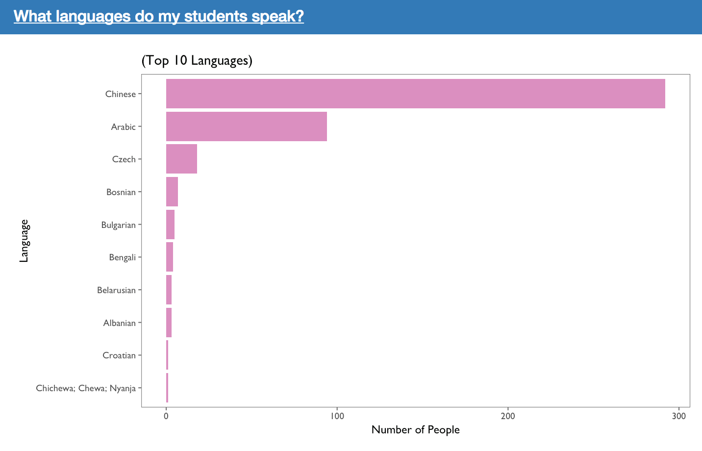
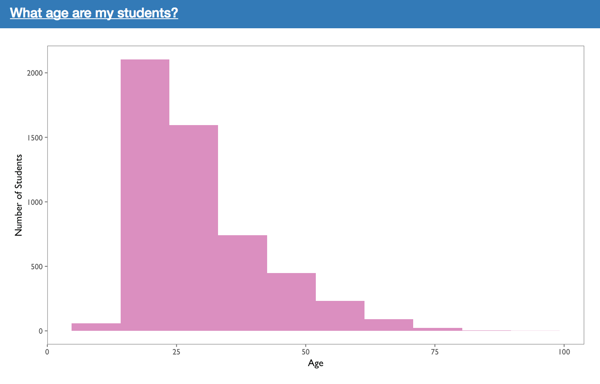

# General Demographics Overview

## Data Cleaning Pipeline

The figure above shows the data cleaning pipeline for demographics data. Raw student demographics data is initially stored in Google BigQuery. It is downloaded and cleaned programatically through the `populate_courses.py` script. Next, the cleaned `wrangle_demographics.csv` file is used to generate the video visualizations.

It should be noted that the data obtained through the use of `generalized_demographics.sql` and `rbq.py` is not the entire dataset of students. Instead, only students with a known IP address are obtained. This was done because IP address is used to infer statistics such as country and language. Please see `generalized_demographics.sql` for details. 

## Visualization Reasoning and Caveats:

In this section, we show visualizations included within our video dashboard. Additionally, the reasoning that went into their design as well as the caveats that go along with those decisions are provided. 

The plot above shows the level of education of the students. This is obtained from the `LoE` variable within the `person_course` table found on Google BigQuery. In order to transform the level of education code to its actual human readable format such as "Doctorate" or "High School", the function `convert_loe` is used. This function **assumes** that the codes of "`p`", "`p_se`", and "`p_oth`" all refer to PhD which translates to a level of education of "Doctorate" in the visualization above. This assumption may not be entirely correct but are based off of the options available on EdX account profiles: 

The plot above shows the top ten countries according to the number of students enrolled. Student's country is inferred from their IP addresses within the variable `cc_by_ip`. This was done because the variable `countryLabel` available in the `person_course` BigQuery table is relatively sparse compared to `cc_by_ip`. 

The plot above shows the top ten languages according to the number of students that speak it. The students' language is inferred from their country which is in turn, inferred from their IP address. This was done because the `language` variable within the `person_course` table in BigQuery was obtained through their modal video transcripts. The original `language` variable seemed very biased towards English and as a result, the the students' language was chosen to be inferred from their country. 

The plot above shows the distribution of ages amongst the learners. It should be noted that all ages less than 5 and greater than 100 have been filtered out. This was done because their are often fake accounts that entered a year of birth such that their age would be 200 or greater. As a result, the histogram would be difficult to read. The thresholds of 5 and 100 can be adjusted through the constants `MIN_AGE` and `MAX_AGE` found within the `general_server.R` file. 

**Developer Note**: The global constants should be transitioned into arguments passed into the `get_age_plot` function within the `general_server.R` file. 