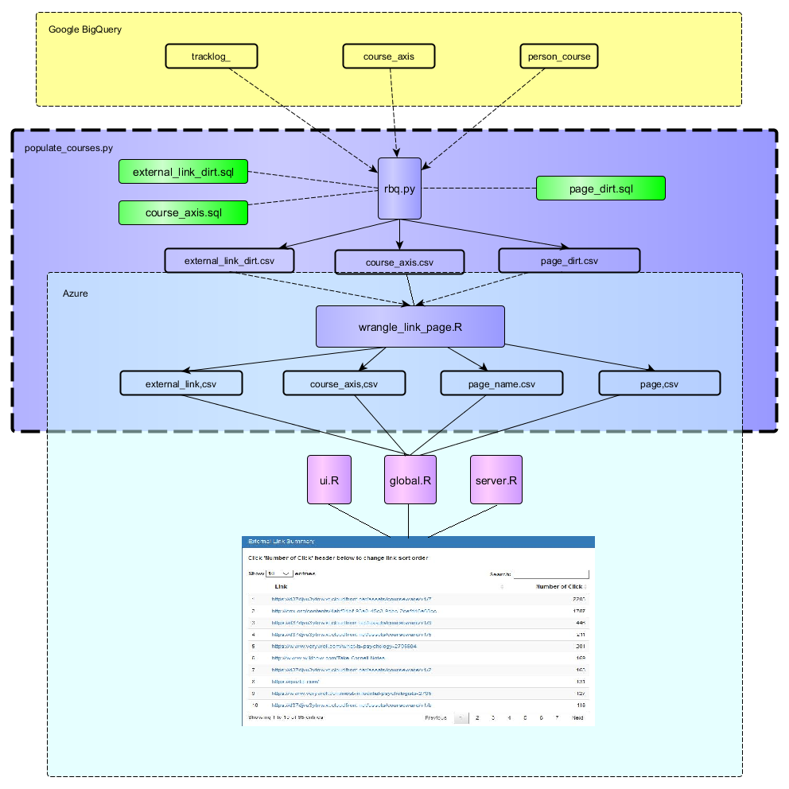
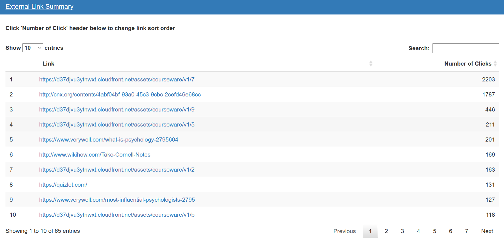
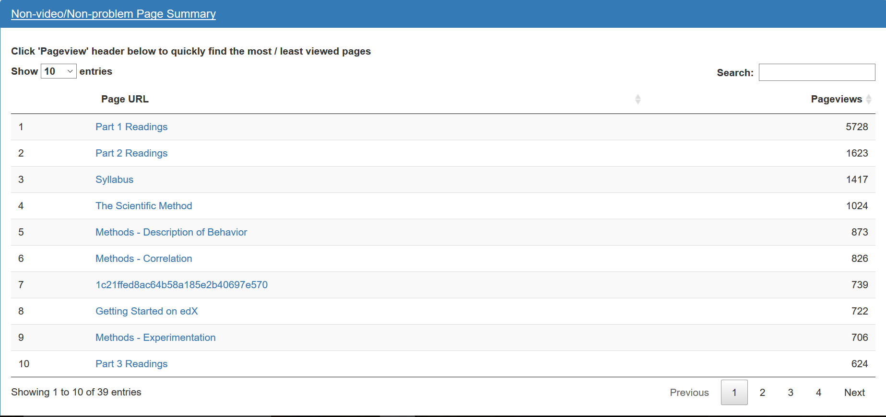

# Link and Page Overview

## Data Cleaning Pipeline

## Visualization Reasoning and Caveats

Instructors often place external links within their courses. These links are are usually a supplementary reference such as an article or video. As a result, student engagement with these links are shown within the dashboard:

Instructors may also be interested in engagement with other course pages that do not contain videos or problems. These pages may include things such as the course syllabus or articles. As a result, the following plot has been included within the dashboard:

Overall, these two tables help instructors accomplish two tasks:

- Determine external links which have abnormal click rates

- Determine which pages which have abnormally high or low views and redesign pages appropriately

