# Discussion Forum Overview

## Data Cleaning Pipeline

All of the forum data is available in BigQuery, but some of the relevant variables are in obscure files that are separate from the standard query tables. Below is a diagram of the pipeline for acquiring and processing the forum data:

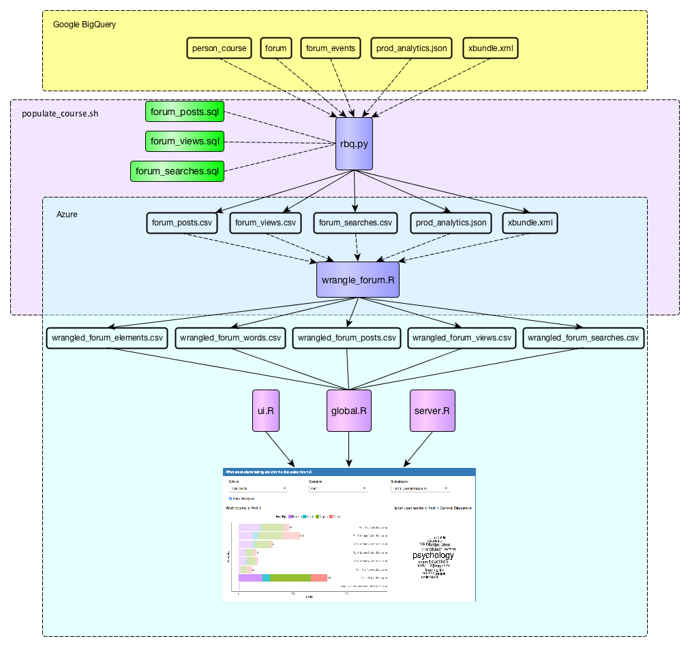

The python script `rbq.py` (**R**un **B**ig**Q**uery) calls three SQL scripts, which query from the BigQuery tables `person_course`, `forum`, and `forum_events`. `rbq.py` also pulls in `prod_analytics.json` and `xbundle.xml`. This results in five raw data files which are then stored on Azure:

* `forum_posts.csv`
* `forum_views.csv`
* `forum_searches.csv`
* `prod_analytics.json`
* `xbundle.xml`

Each of these files passes through `wrangle_forum.R`, which results in five new files:

* `wrangled_forum_posts.csv`
* `wrangled_forum_views.csv`
* `wrangled_forum_words.csv`
* `wrangled_forum_searches.csv`
* `wrangled_forum_elements.csv`

Each of these is then loaded into the edXviz dashboard.

### Hierarchy of the Discussion Forums

One of the primary goals of the forum view of the edXviz dashboard is to assist the user in viewing student engagement at different levels of aggregation within the discussion forum's hiearchy. The hierarchy is shown in the diagram below:

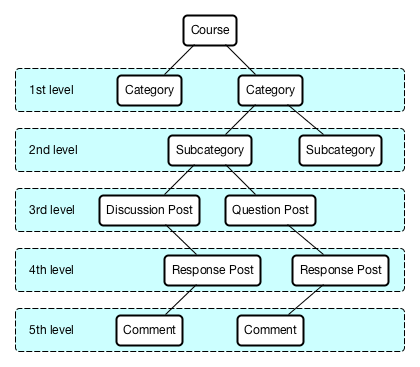

Within a given course, the highest level of the hierarchy is comprised of *categories*. These are often given titles such as "General Questions", "Part 1", or "Assignments", although these are determined entirely by the instructor or course designer. Crucially, categories do not necessarily have a one-to-one correspondence with the modules of the course, and therefore their sequence may not have a temporal element.

Some categories may have *subcategories*. If so, each of the discussion posts in that category will be associated with exactly one subcategory.

There are two types of *Initial* posts: *Discussion* posts, and *Question* posts. These are determined by the user when they create the post; they must select a radio button before submitting. Initial posts, whether Discussion or Question, are also given titles, determined by the poster.

After an Initial post has been created, users can create *Response* posts, each of which will be associated with exactly one Initial post. After a Response post has been created, users can create *Comment* posts, each of which will be associated with exactly one Response post.

### Hierarchy Data Integrity Issues

One of the main challenges of wrangling this data was that the variables and unique identifiers associated with each level of the hierarchy have different names, or are occasionally missing, in each of the relevant files. I've summarized these discrepancies in the table below.

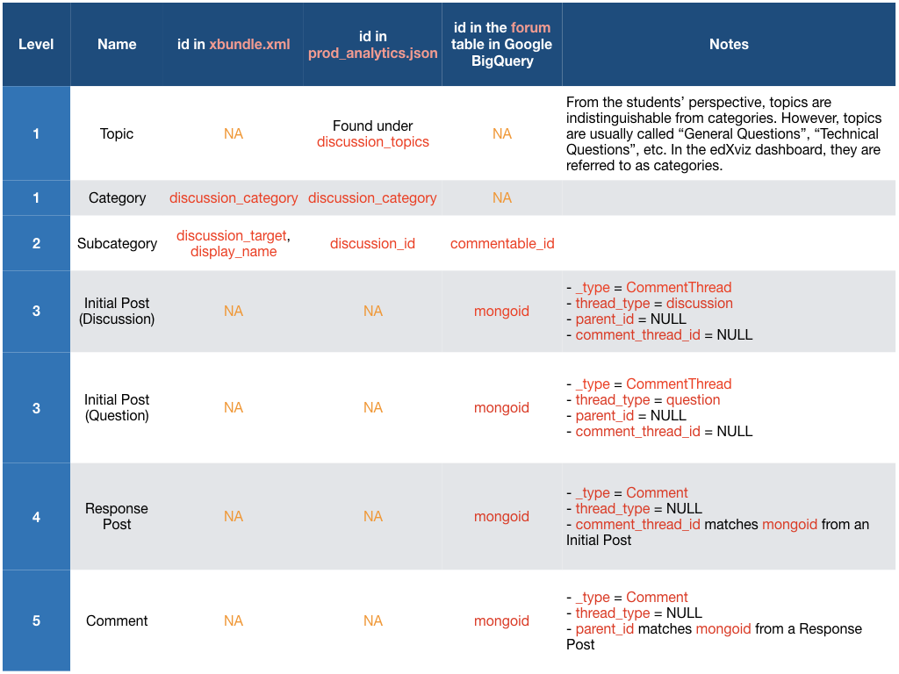

The reason I join with the prod_analytics.json file is that it is the only one that has all the category and subcategory names. The reason I join with the xbundle.xml file is that it is the only one that has the correct ordering of categories/subcategories, as defined by the instructor.

## Visualization Reasoning and Caveats

### Filter panel

At the top of the forum view, like in all the views, there is a panel for filtering students:

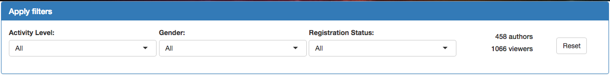

The filter panel allows the user to subset the students according to three variables:

* Activity level (defined by the total time spent on the course website)
* Gender
* Registration Status (verified or audit)

There is one other dropdown menu that affects the filtering: *Category*. This was placed in the main plot for easier navigation, especially in conjunction with the *Subcategory* dropdown, which only appears when a category has been selected.

The forum filter panel also displays two numbers:

* Number of authors: the number of filtered individuals who have posted at least once in the discussion forum.
* Number of viewers: the number of filtered individuals who have viewed the discussion forum at least once.

Authors and viewers are *not* disjunct groups. That is, if you are an author then you are probably a viewer (more on why "probably" below), but if you are a viewer then you are not necessarily an author.

Another important note is that when a category is selected in the main plot, this will update the numbers displayed in the filter panel. But when a subcategory is selected, it will *not* update the numbers. This is by design; the intention is that the numbers in the filter panel show the totals for all the bars that appear in the main plot at any given moment, even if those bars are not selected.

One final feature of the filter panel is the *Reset* button, which allows the user to quickly go back to all students and all categories. The only thing that the Reset button does not change is the variable on the x-axis of the barchart. The assumption is that instructors would mainly be using the Reset button to remove filter settings, not to change the variable of interest.

### Barchart

The purpose of the main barchart is twofold. First, it is to enable comparisons of engagement across forum categories and subcategories. This tells the instructor which categories are the most active. Second, it is to identify categories or subcategories that may be worth examining in greater detail, using the wordcloud or the forum threads table.

The main barchart displays either categories or subcategories on the y-axis, and one of three variables on the x-axis, depending on the user's selections. The default variable that is shown on the x-axis is the number of posts:

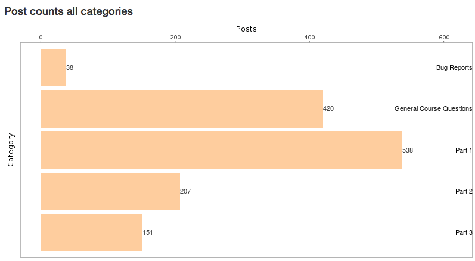

The categories and subcategories are ordered by the layout that the instructor or course designer defined when writing the course XML. There was a time when there was a radio button for reordering the bars by their rank on the numeric variable on the x-axis, but through useability testing, we determined that most courses have two few categories, or subcategories per category, for this to be a useful enough feature to justify adding more clutter to the interface.

If the user selects the checkbox that says "Show post types", then the barchart becomes a stacked barchart, with each color representing a different post type:

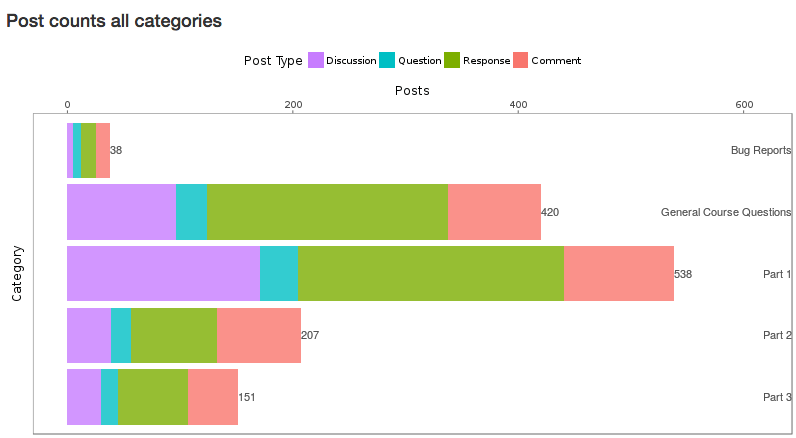

This is an important feature because it helps the user distinguish between categories or subcategories where the students are engaging with each other (indicated by a healthy mix of initial posts, responses, and comments) and categories or subcategories where students are simply writing into a void (indicated by a high number of initial posts, but few responses or comments).

The barchart can also show the number of unique authors who have participated in each category or subcategory:

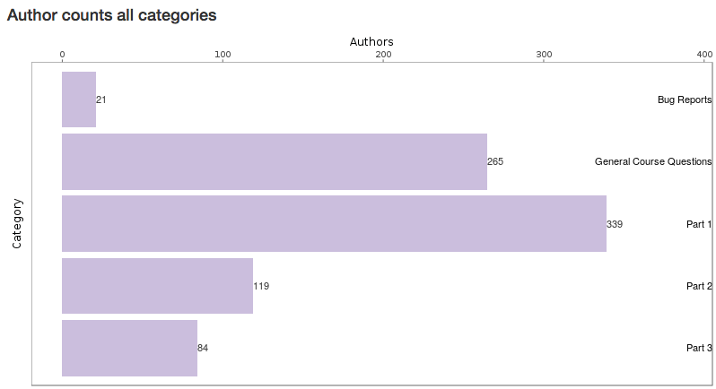

This is included partly to give information that is isomorphic to the information that is provided in the Eiffel Tower plot, and partly to help instructors distinguish between categories or subcategories where many *students* are participating, and categories or subcategories where there is lots of *participation* but few students are responsible for it. On this note, one idea for another variable option for the x-axis would be posts per student (who posted at least once in that category or subcategory). This would tell the instructor which categories or subcategories are especially conducive to multiple posts by a given student. This additional option would not be difficult to implement.

Finally, the barchart can show the number of views in each category or subcategory.

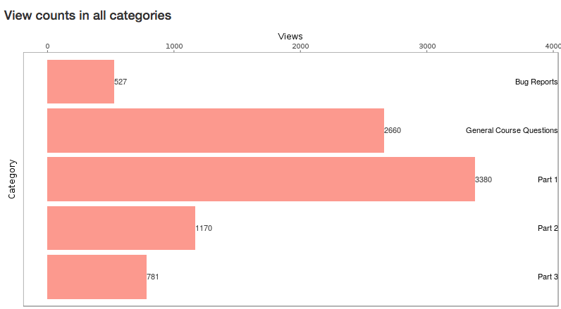

This option is included because many students are active readers of the discussion forums, but rarely write posts themselves.

A view is defined as a pageview of an initial post. So, the view will only be recorded if the user has clicked on one of the initial posts whose titles are listed on the left-hand side of the edX discussion forum (circa June 2017). In BigQuery, this event is defined as `forum_action` = `read` in the `forum_events` table, where `thread_id` matches the `mongoid` of either a discussion post or question post in the `forum_posts` table. Currently, it is not possible to track views of specific responses or comments.

There is another type of view event listed in BigQuery, which is deliberately ignored in the edX dashboard. These are events when the user views the titles of the initial posts in a given subcategory, but has not yet clicked on one. In BigQuery, this event is defined as `forum_action` = `read_inline` in the `forum_events` table. For future reference, is possible to identify the subcategory the student is browsing in because `subject` in the `forum_events` table matches `commentable_id` in the `forum_posts` table, and `discussion_id` in `prod_analytics.json`.

### Wordcloud

When the instructor goes to the discussion forum itself, they have no way of getting a high-level picture of the topics being discussed in their course. This is the goal of the wordcloud, which shows the most-used words at whichever level of aggregation the user has selected:

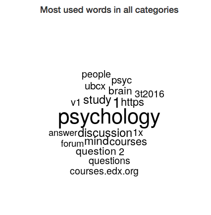

For example, if all categories are selected, then the wordcloud shows the most-used words (written by the filtered students) in the whole course. If a category is selected, the wordcloud shows the most-used words for that category. Likewise, if a subcategory is selected, the wordcloud shows the most-used words for that subcategory.

### Threads Table

By default, the threads table shows the most-viewed initial posts for whatever level of aggregation the user has selected. The user can reorder by the number of responses or comments, if they like, and they can also search for specific users, subcategories, or words. This table is included so that the user can obtain details on demand, i.e. drill down even further than the selected subcategories in the barchart. This also allows for verification of the post type counts shown in the stacked barchart, as well as verification of the wordcloud. (However, the wordcloud shows words from responses and comments as well, which are not included in the threads table. This could be easily changed, if it is desired.) Finally, the threads table provides context for the words that show up in the wordcloud.

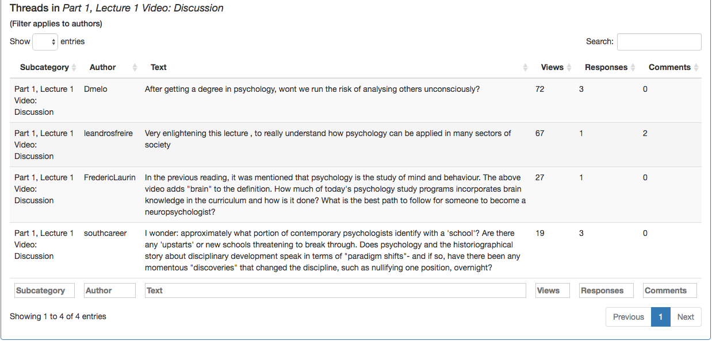

### Searches Table

The edX discussion forum has a search bar, which allows users to look up keywords of interest. This data is tracked, and could be useful to instructors, as it likely correlates with questions or interests that students have. The searches table ranks terms by the number of unique users who have searched for them.

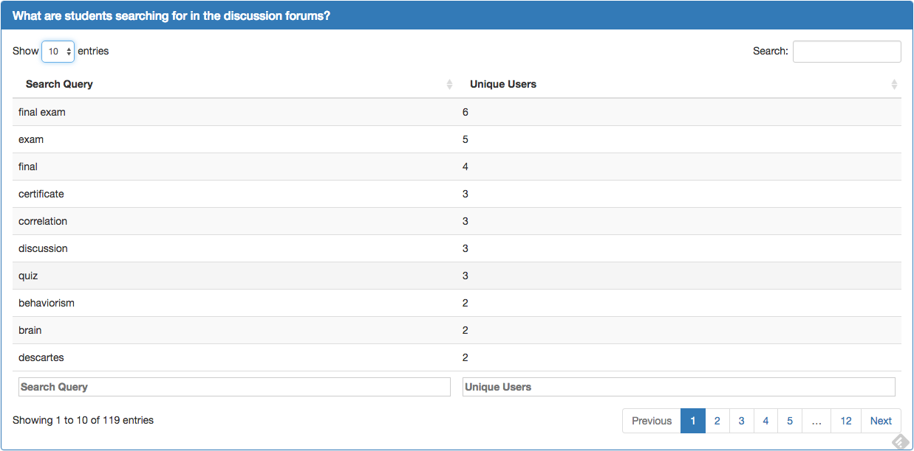

The searches table, like all the other elements of the forum view, is updated when the user changes the settings in the filter panel. This allows the instructor to figure out, for example, what verified students are searching for.

### Interactivity and Navigation

Aside from the filter panel, the user has four options for interacting with the forum view of the dashboard. The first is the x-axis variable. The second is the checkbox, "Show post types", which only appears if the x-axis variable is "Posts". When this checkbox is selected and all categories are selected, the full main view of the dashboard should look like this:

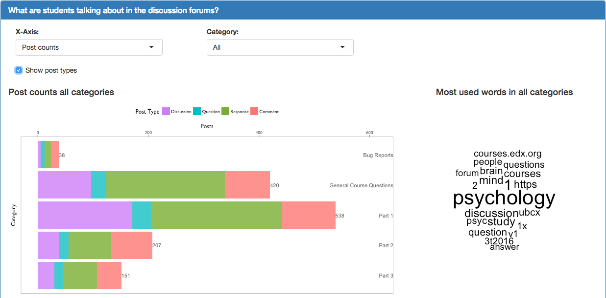

The third option for interactivity is Category dropdown menu. When a user selects a category, the barchart will show one bar for each subcategory in the selected category. Also, a new dropdown menu will appear — the fourth option for interactivity — which allows the user to select a subcategory:

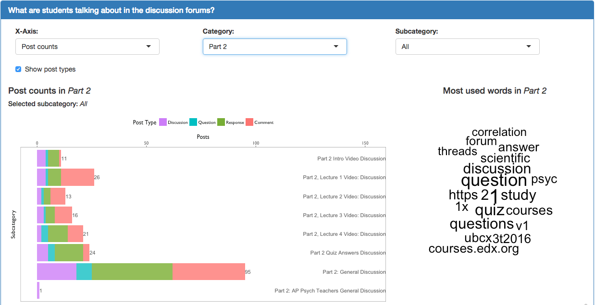

When the user does select a subcategory, the transparency of the unselected bars will be diminished, like so:

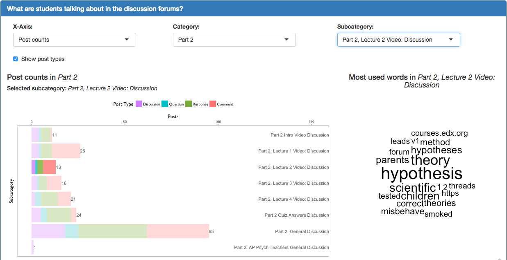

The titles and subtitles of the barplot, wordcloud, and threads table will also be updated to reflect the user's selections.These small changes help to keep the user mentally situated at whichever level of the hierarchy they have chosen to view information.
