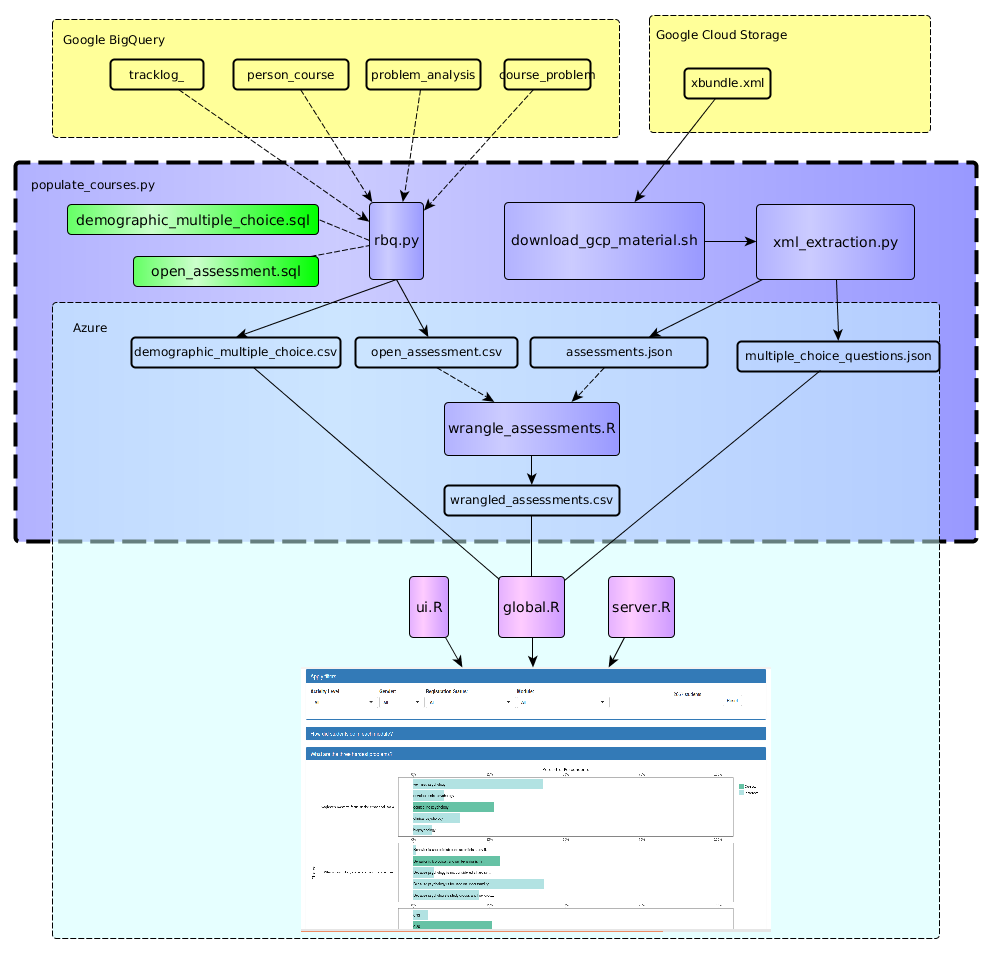
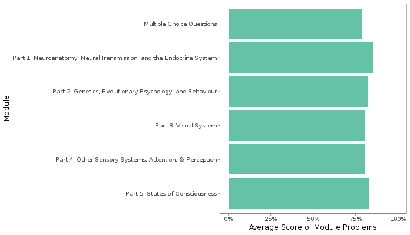
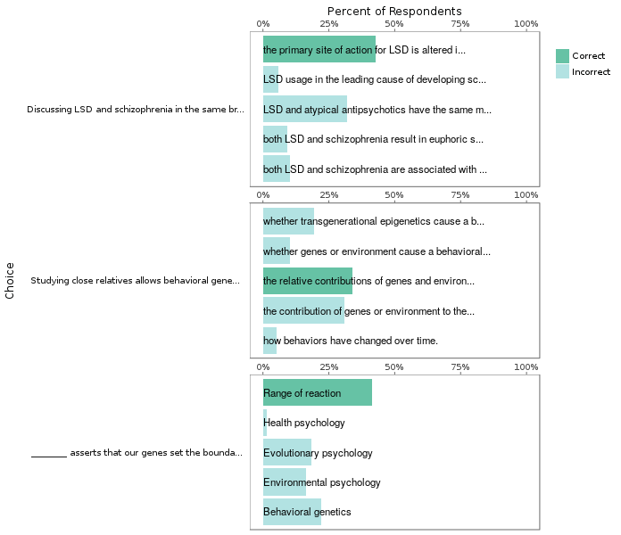
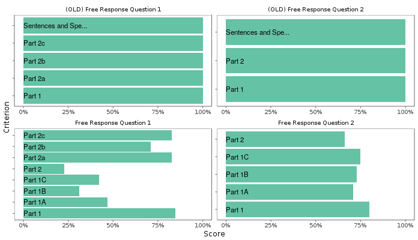

# Problem Overview

## Data Cleaning Pipeline

There are two sources that problems draws from, the `xbundle.xml` found on Google Cloud Storage and Google BigQuery. Two SQL scripts are used to generate the data for the problems dashboard. The first, focused on multiple choice problems, retrieves data the `problem_analysis`, `course_problem` and and `person_course` tables. The second, focused on Open Response Assessments (ORAs), retrieves submission data from the event logs. Xbundle is used to look up questions and response strings from their IDs.

The useful data in the Xbundle is extracted into JSON files by `xml_extraction.py.` The assessment data involves some regular expressions and is too slow to calculate oat run-time, so it is further processed by `wrangle_assessments.R`.

## The Structure of Problems and Assessments

Currently, the problem dashboard only supports two types of problems: `choicegroup` and `checkboxgroup`. Both of these problems are multiple choice but `checkboxgroup` has several correct answers that must all be selected for full credit. Open Response Assessments can be evaluated by self, peer, or TA/instructor and can have an arbitrary number of items in it's rubric. As an example, a programming assessment my assess the student on passing edge cases and code style. 

Assessments with only one item their rubric and multiple choice problems that have only correct responses are filtered out of the dashboard. Typically, these signal a survey question or ungraded self-reflection response.

## Visualization Reasoning and Caveats

### Module Overview

The goal of the module overview is to provide the instructor with data on the difficulty curve of the entire course. All questions in each module are scored out of 100 and averaged. Note that the relative weights of the problems are not included. The modules appear in the same order as in the XML. The XML also dictates the name of the modules. Sometimes malformed XML can lead to sub-optimal module names.

### Hardest Problems

The three hardest problems intend to show the hardest problems (ordered hardest to least hard) and the response of each student. The aim of this plot is show not only show which problems students are struggling on, but also why they might be struggling. This plot works especially well with the module filter, since it allows the instructor to drill-down to the toughest problems for each module.

### Assessments

The assessments plot is a new feature to the EdX dashboard. It allows the instructor to see not only how students did on ORAs but also how they did in different subcategories. Note that unlike the multiple choice questions, 100% grades are allowed for assessments.

