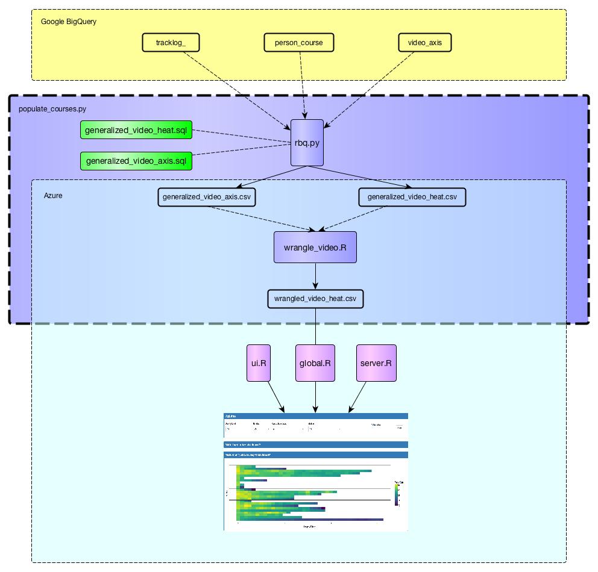
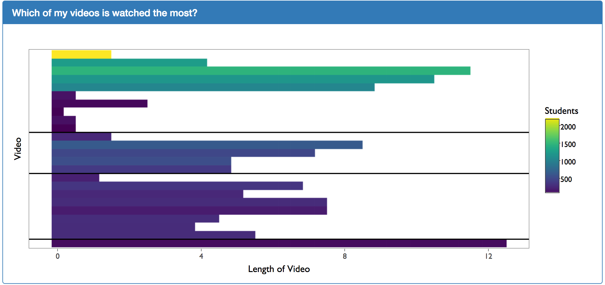
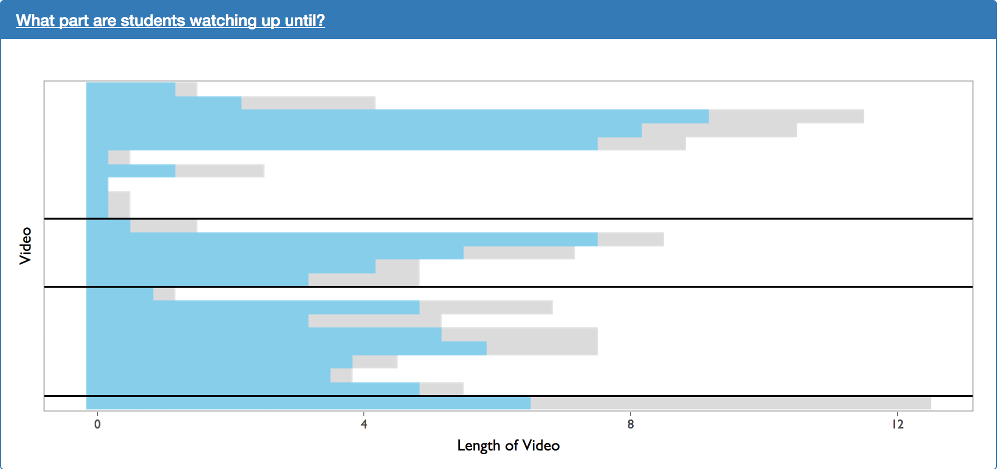
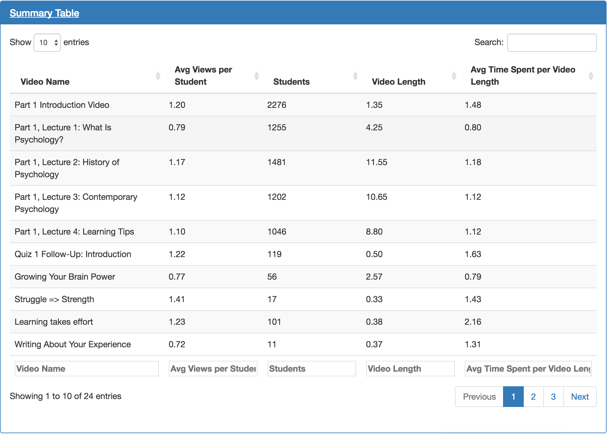

# Video Overview

## Data Cleaning Pipeline

The figure above shows the data cleaning pipeline for video data. Raw track log and video data is initially stored in Google BigQuery. It is downloaded and cleaned programatically through the `populate_courses.py` script. Next, the cleaned `wrangled_video_heat.csv` file is used to generate the video visualizations.

## Visualization Reasoning and Caveats:

In this section, we show visualizations included within our video dashboard. Additionally, the reasoning that went into their design as well as the caveats that go along with those decisions are provided. 

The main purpose of the plot above is to gain the trust of the instructor. Intuitively, instructors will already know that videos that occur later in the course are going to have less students because students are more likely drop the course. This allows instructors to trust what is put in front of them by seeing something that is intuitively correct. Additionally, this plot is a good introductory to the next plot. Initially, during usability testing, when showing the heat map plot below without showing the length of video plot above, instructors felt overwhelmed and had trouble interpreting the visualization. 

The heat map plot above shows which parts of the video are being viewed the most. The "watch rate" of each segment is calculated by the following equation:

$$\text{Watch Rate} = (\frac{\text{Number of times a segment has been watched}}{\text{Number of unique students who have started the video}})$$
In the above calculation of the watch rate, the "number of times a segment has been watched" is the raw count regardless of uniqueness of the user. This means that is a new user watches a video segment twice, the "number of times a segment has been watched" will increase by two

The plot above was created as a request from usability testing. This shows the average maximum time that a users reach in a video. However, the diagram is slightly misleading. We are simply taking the **maximum** time that users reach in a video. We are not accounting for the fact that users max have skipped ahead in video time to achieved their maximum time in the video. This problem can be fixed relatively easily in future iterations. 

The plot above shows instructors which segments have abnormally high and low watch rates. It works by creating a linear model used to predict the watch rate of a given segment. The linear model is based on the video's occurrence in the course as well as the segment's position within the video. Once the predicted value has been calculated, segments with the highest and lowest residuals are highlighted. 

The table above shows much of the information already displayed in the visualizations above. During usability testing, it was discovered that users often want to see the actual numbers as well as the visualizations. 