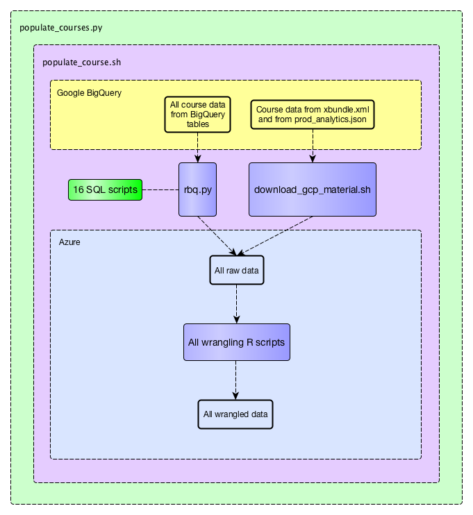

--- 
title: "edXviz: Interactive Visualization of Student Engagement with edX MOOCs"
author: "Matt Emery, David Laing, Andrew Lim, Subi Zhang"
date: "`r Sys.Date()`"
output:
  bookdown::gitbook:
    config:
      toc:
        collapse: section
documentclass: book
---

# Overview of the Project

## Introduction

edXviz is a capstone project completed by Matthew Emery, David Laing, Andrew Lim, and Subi Zhang, in partial fulfillment of the degree requirements for the Master of Data Science at the University of British Columbia (UBC). The project was completed in partnership with the Centre for Teaching, Learning and Technology (CTLT) at UBC.

Hundreds of thousands of students worldwide are enrolled in UBC's many massive open online courses (MOOCs). These MOOCs generate huge amounts of data, much of which could be used to help instructors understand how students are engaging with their courses. For our capstone project, we built a dashboard that is accessible to MOOC instructors directly in their edX course website. The dashboard will help instructors to discover patterns across the structures of their courses, with a special focus on course elements where student engagement is especially high or low. The dashboard includes visualizations of how students are interacting with course content such as videos and pages, how they are performing on problem sets, and how they are behaving in the discussion forums. edXviz is available as an open-source R package, and development is ongoing.

## Availability of Data

All of the data used in this project is stored in Google BigQuery. Most of it is in relational tables, although some is in other file formats. See below for an overview of the main script that is used to acquire and prepare the data for loading into the dashboard:

<center></center>

The python script `populate_courses.py` will acquire and process all the data for a user-defined list of courses. For each course, the bash script `populate_course.sh` is called. `populate_course.sh` calls the python script `rbq.py` sixteen times, each with a different SQL script as an argument, as well as `download_gcp_material.sh`, which downloads a JSON file and an XML file. `populate_course.sh` then calls six R scripts, each of which wrangles the data for one of the six views of the dashboard. The dashboard itself is a modularized R Shiny app, which is intended to be hosted on Microsoft Azure in a Docker container.

## Contents of this Document

The edXviz dashboard has six separate views, each of which shows a different type of data:

* Engagement Overview (or "Eiffel Tower" plot)
* General Demographics
* Links and Pages
* Discussion Forum
* Problems
* Videos

This document devotes two sections to each of the views. In each view's first section, we describe the data preparation process in greater detail, and provide explanations of each of the visualizations. In each view's second section, we provide standard R documentation for the functions that were used to wrangle that data and serve it in the Shiny app.

Finally, we provide a step-by-step guide for deploying the app on Microsoft Azure.

## Acknowledgments

We are grateful to many of our colleagues at UBC. Especially, we are grateful to our capstone partners, Ido Roll and Sarah Perez, who came up with the project and were extremely generous with their time, energy, feedback, and support. We are also grateful to our mentor in the Master of Data Science program, Giulio Valentina Dalla Riva, whose advice was invaluable. Lastly, we are grateful to the many people who provided valuable feedback throughout our development process, including Leah Macfadyen, Letitia Englund, Derek White, Scott McMillan, Pan Luo, Sanam Shirazi, Giuseppe Carenini, Manuel Dias, Jason Myers, Raeanne Lee, Sazi Valair, Erika Thompson, Patrick Dubois, Aviv Milner, and others.

## Instructions for generating this bookdown document

Navigate to the edx_viz_documentation directory in our capstone repository, and run the following code in R:

```r
bookdown::render_book('index.Rmd', 'all')
```