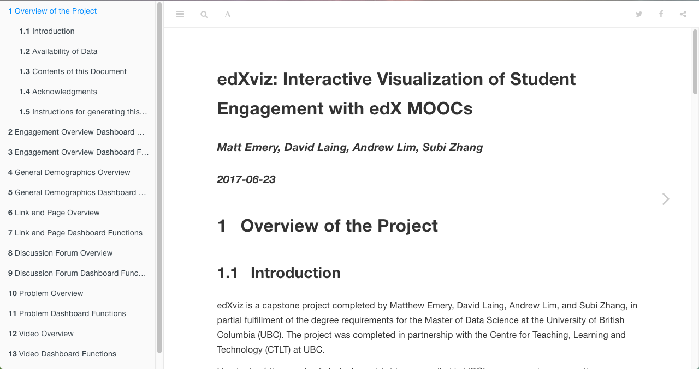

layout: presentation
title: Future of the MOOC Learning Analytics Project
permalink: /renthop-presentation/
class: center, middle, inverse
# Future of the project

* Deploy for all UBC courses
* Submit for publication/CRAN
* Present at edX conference in November
* Hopefully, deploy for all edX courses

---
# Documentation

---

# Wishlist

* Advanced filter options
* "Download Data" option
* Prediction of student success & drop-out
* Functionality for A/B testing
* Social network analysis

---