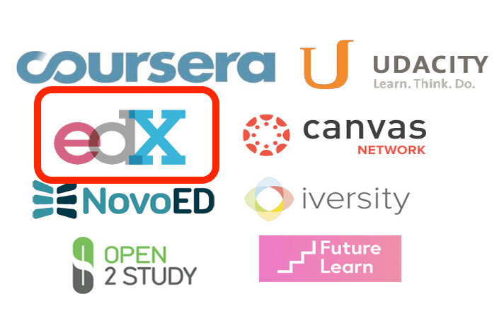
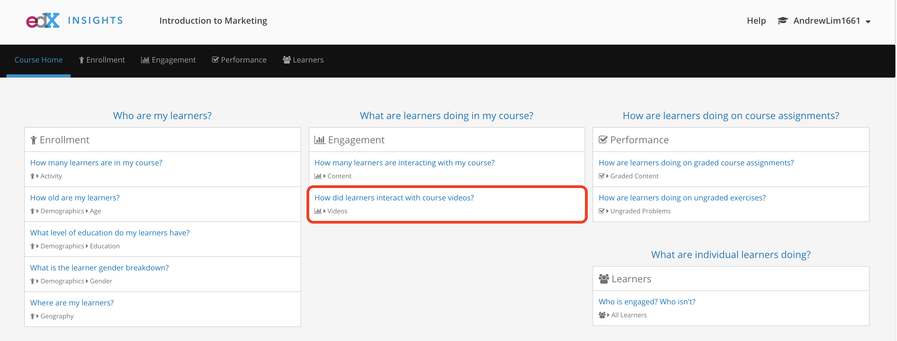
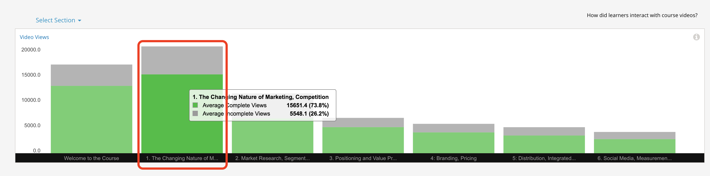
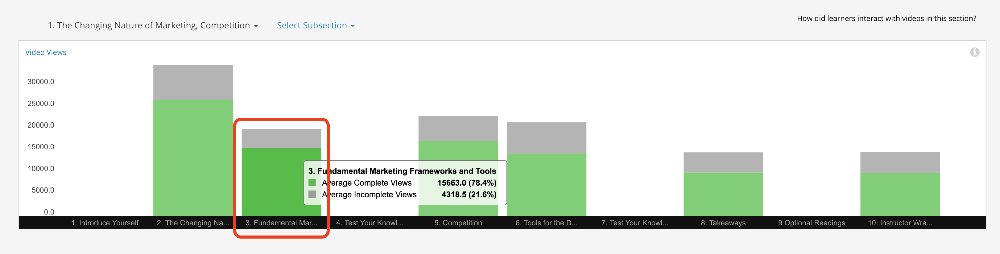
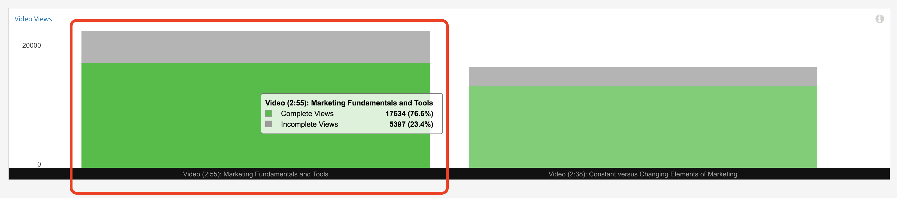
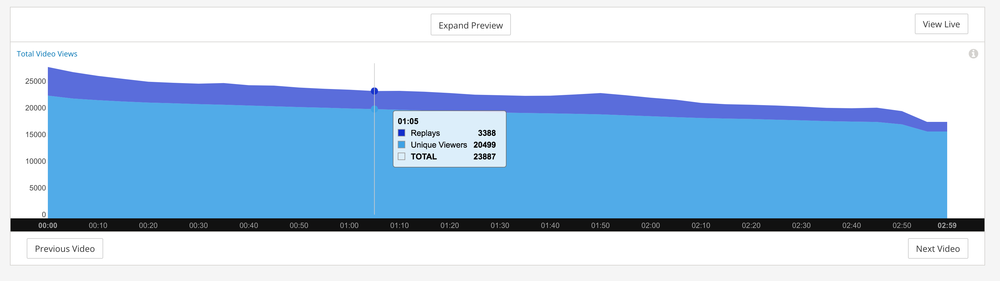

layout: presentation
title: edX Instructor Dashboard
permalink: /renthop-presentation/
class: center, middle, inverse

# Introduction

*image source: https://www.diygenius.com/wp-content/uploads/2013/08/ultimate-mooc-guide.jpg*

---
# Main Goal
#### Create the next dashboard iteration
* Current existing solution:

---

---

---

---

---

# Help instructors to answer key questions:
  * Who are my students? (General demographics)
  * What is the overall structure of my course?
  * How are students engaging with my videos?
  * How are students performing on the problems?
  * How are students interacting with the forums?
