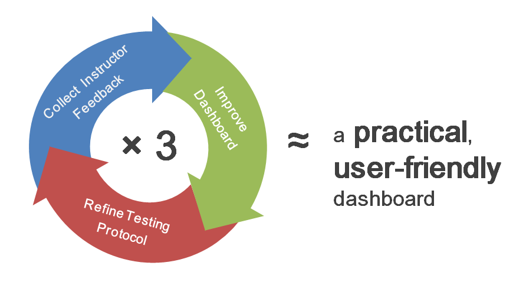
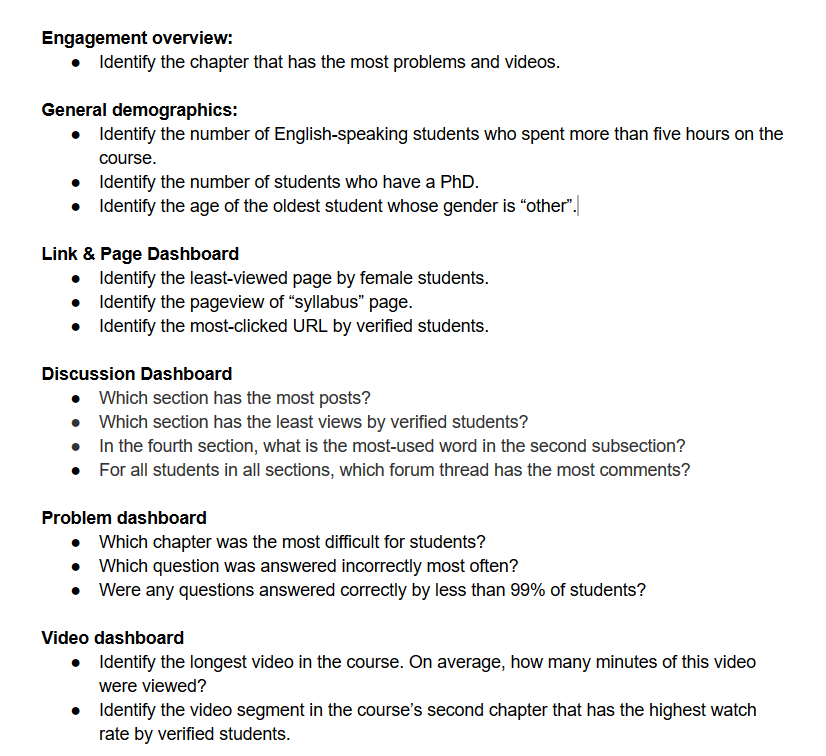
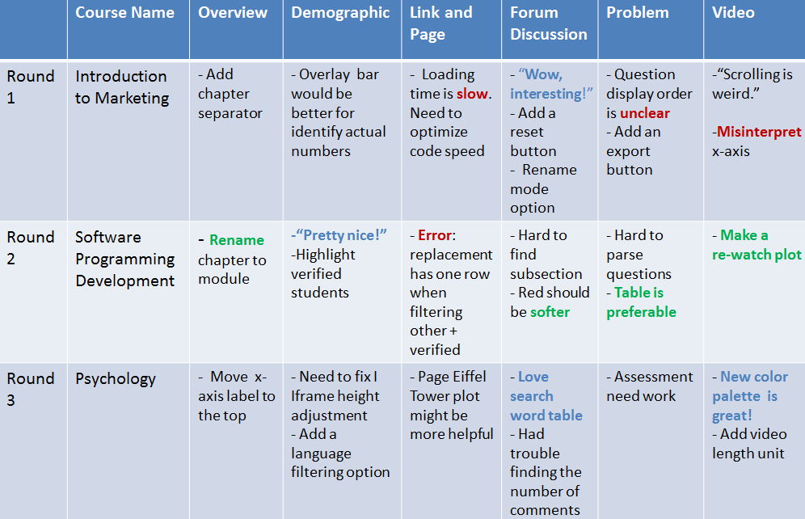
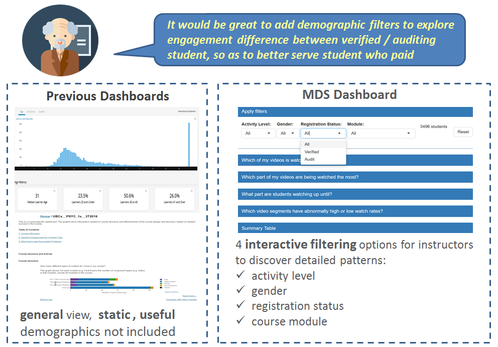
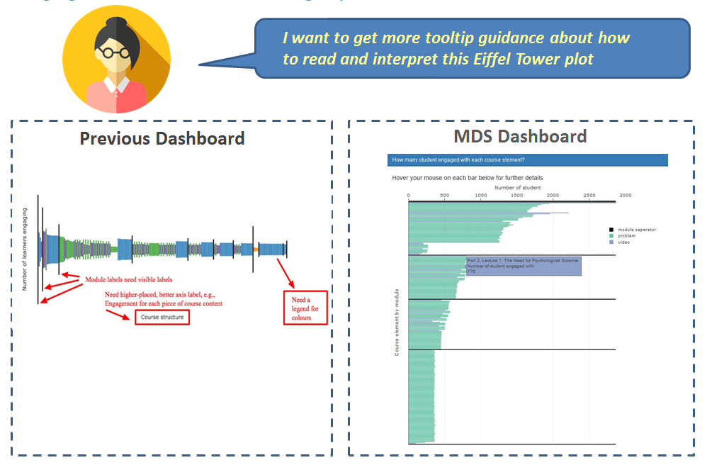
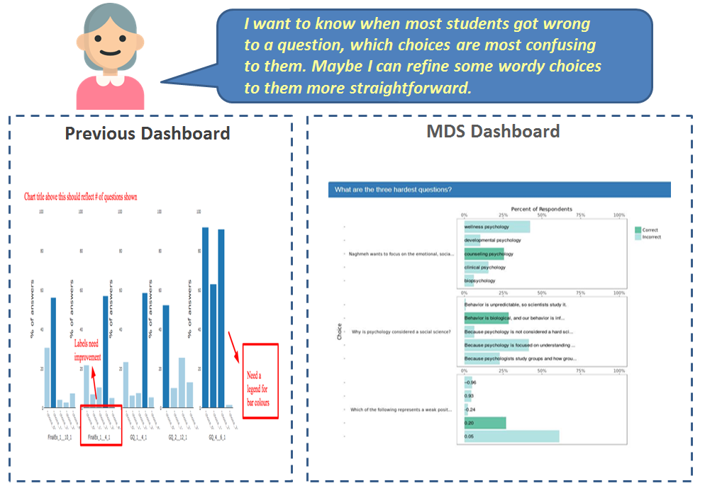
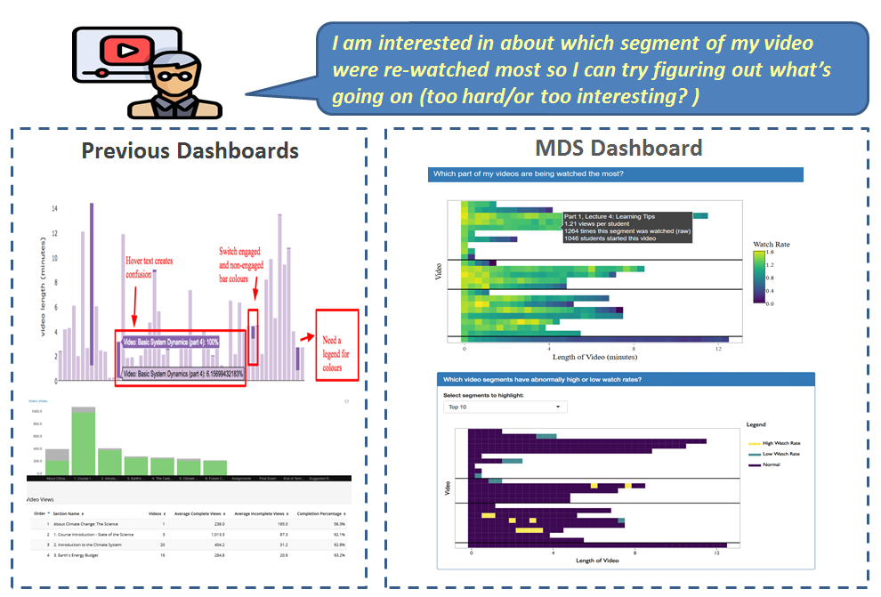
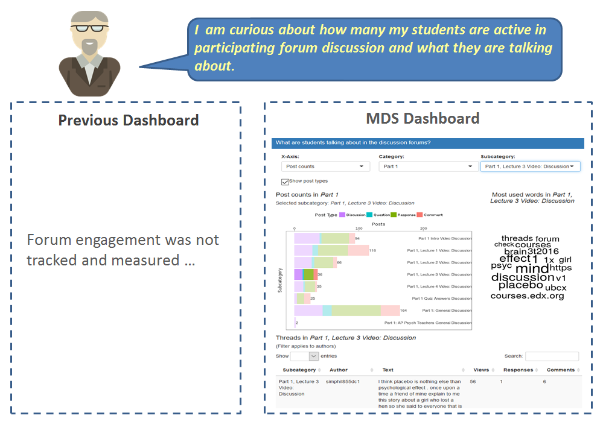
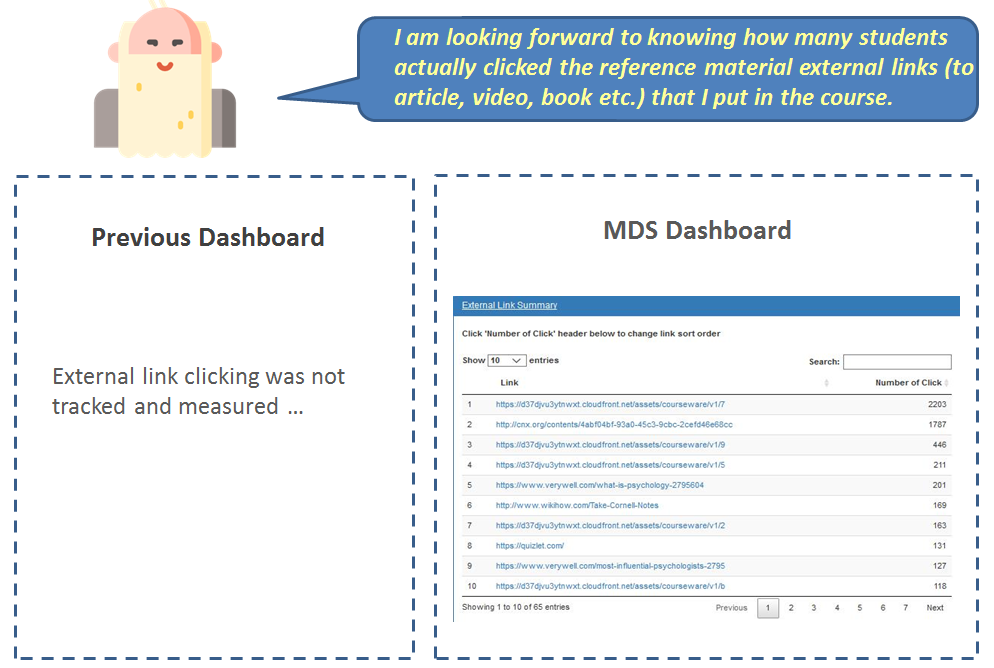

layout: presentation
title: Usability Testing in MOOC Learning Analytics Group
permalink: /renthop-presentation/
class: center, middle, inverse
# Usability Testing in MOOC Learning Analytics Group

---
# How does our usability testing work?

---
# Testing Protocol

###  1. Pre-test Question  

- What kind of information about student learning do you want to get and have no access to now?

### 2. Scavenger Hunt

### 3. Post-test Questions

- What was confusing or frustrating about using or interpreting the dashboard?
- What information, if any, seemed particularly useful to you?
- What did you want to know more about?
---
# Excerpts from Instructor Feedback

---

# How do we deal with hundreds of requirements from instructors?

Create a universal remote control to satisfy everyone's need ？

### No ! ! !

###  We devoted every effort to target six key pain points that have been mentioned a couple of times by instructors.

---
# Instructor Pain Point 1: **No interactivity to explore detail**

---
# Instructor Pain Point 2: **Confusing Eiffel Tower Plot**

---
# Instructor Pain Point 3: **Lack of granular analysis about wrong choices in graded-problem **

---
# Instructor Pain Point 4: **Lack of in-depth understanding on student video watching behavior**

---
# Instructor Pain Point 5: **No access to forum discussion data**

---
# Instructor Pain Point 6: **No access to student clicking record about external link **

---
