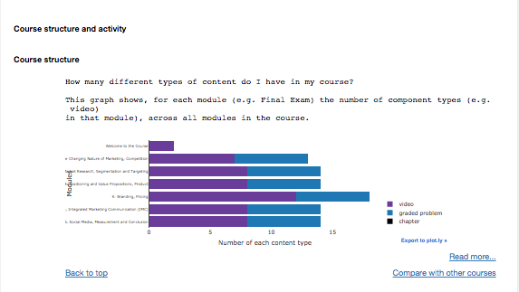
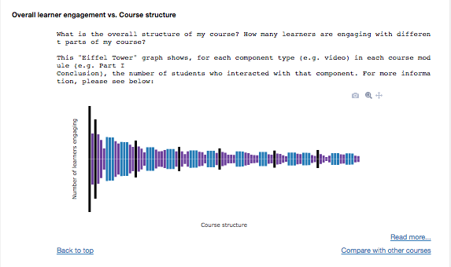
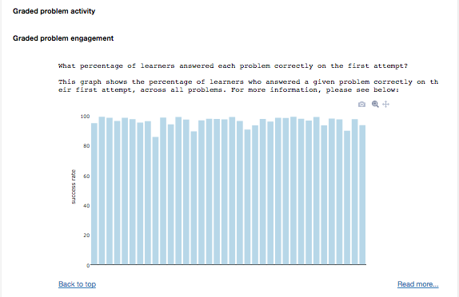
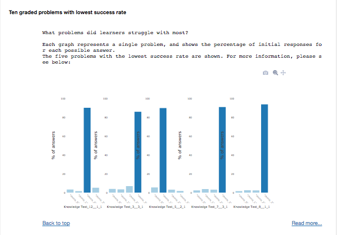
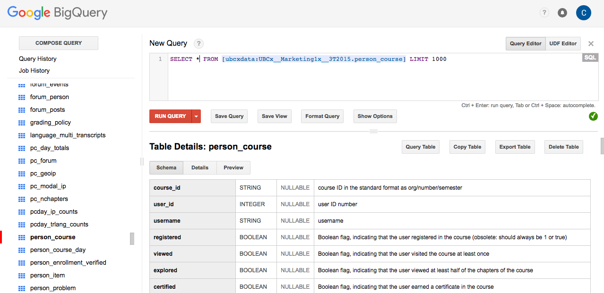
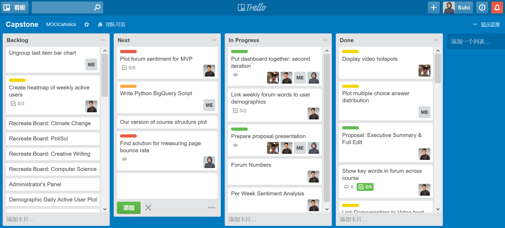
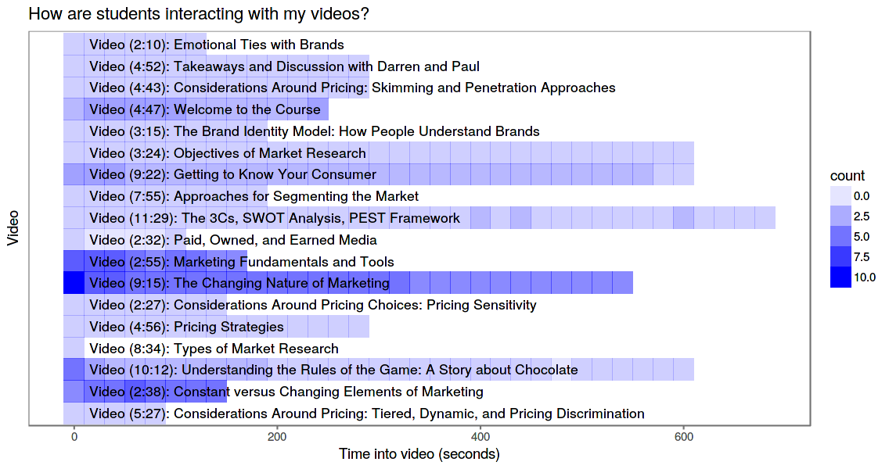
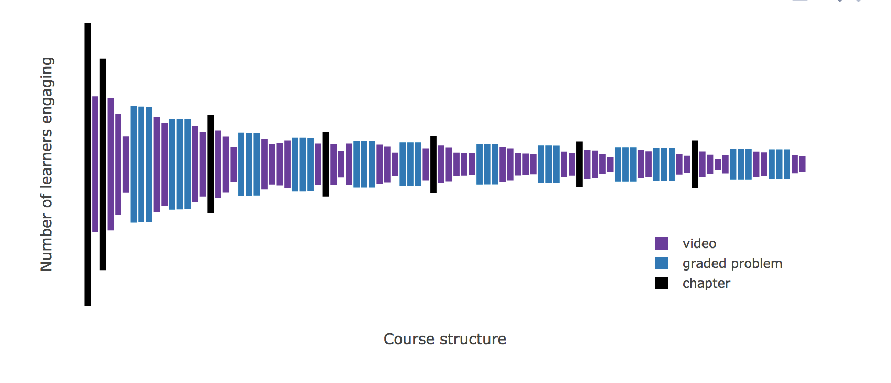
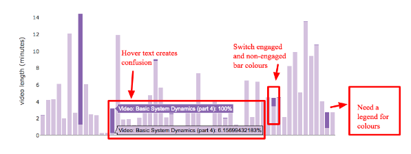
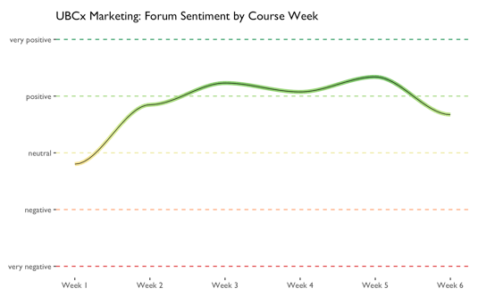

# Executive Summary

## MOOCs generate tons of data

 - demographic information
 - webpage interactions
 - video interactions
 - success rates on problem sets
 - discussion forums

---

### Data provides an opportunity for instructors

|        |        |
| :----: | :----: |
|  |  |
|  |  |

---

## We are proposing an improved instructor-facing dashboard

**Proposed improvements:**

 - add linked views, to understand patterns across different demographics
 - guide the user toward course elements that are worthy of special attention
 - visualize new subsets of the data, such as discussion forums and course pages

# Availability of appropriate data

---

### Overview

- Most of the data is stored in Google BigQuery as structured tables, which we can access using SQL. 

---

### However, we will face three main data challenges: 

1. The available data varies from course to course.

2. The data is poorly documented; variable descriptions are often missing.

3. Some of the event data is stored in JSON log documents, so we may need to develop a data cleaning pipeline.
 
# Identification of risks and mitigation strategies

---

## Potential risks

- **Integration**: We wait too long before attempting to generalize the dashboard to multiple courses

- **Tool choice**: We don't decide early on which tool to commit to (e.g. Shiny, d3, etc), and end up wasting time fixing bugs with the wrong tool (shiny might be too slow to load full datasets).

- **User-friendliness**: Dashboard is not intuitive and actionable enough for instructor; we don't significantly improve upon the two existing dashboards (CTLT and edX).

---

## Mitigation Strategies

--- 

1. **Collaboration Conduct**
    
- Set weekly deadlines as a team, and stick to them by using Trello, a task management system.

- Comment our code as clearly as possible, especially when working on sub-tasks as individuals.

---

2. **External Communication**

- Communicate regularly with the CTLT team and the MOOC instructors to get their feedback on our dashboard versions.

- Set up user testing sessions as early as possible.
    
3. **Other**

- Attempt to generalize the dashboard to multiple courses as early as possible.

# Deliverables

---

## Instructor-Facing Dashboard 

-   Course structure
-   Student engagement and performance
-   Demographics

---

## Course Structure

**Currently**

 - Instructors are often unclear about the structure of their courses
 - They do not know how many students interact with each element

---

## Improvements

 - Demographic Information
 - Interactive elements to highlight engagement

---

## Student engagement and performance

**Currently**

 - The current dashboard requires too much drilling down
 - No information about the student forums

---

## Improvements

 - We will highlight the most and least interacted with elements
 - We show the problems with the highest and lowest success rate
 - Visualizations that express forum sentiment

---

## Demographics

**Instructors are interested in:**

-   Language
-   Geographic location
-   Academic background
-   Learner type (e.g. students who only watch videos vs. students who only do assignments)
-   Learning goals (e.g. students who are auditing the course vs. students who are paying and seeking a certificate)

**We plan to link demographic data with every other visualization through scented widgets**

# MVP Assessment

---

## MVP Assessment

 - Challenge: Subjective
 - Ability to answer instructors' key questions:
    - How are my students performing?
    - How are my students engaging with the course?
    - What is the overall structure of my course?
    - How can I change my course to be better?
 - Scalability
 - Robustness and maintainability 
 - Adherence to relevant best practices in visualization

# Timeline

---

<table>
<colgroup>
<col width="16%" />
<col width="16%" />
<col width="16%" />
<col width="52%" />
</colgroup>
<thead>
<tr class="header">
<th>Start</th>
<th>Stop</th>
<th>Title</th>
<th>Description</th>
</tr>
</thead>
<tbody>
<tr>
<td>2017-05-04</td>
<td>2017-05-11</td>
<td>MVP</td>
<td>Finish the marketing course MVP</td>
</tr>
<tr>
<td>2017-05-11</td>
<td>2017-05-25</td>
<td>Generalized MVP</td>
<td>Ensure that the MVP works for other courses (Climate Change, Programming, China, Creative Writing)</td>
</tr>
<tr>
<td>2017-05-25</td>
<td>2017-06-08</td>
<td>User testing</td>
<td>Connect with the administrators of each course and get their feedback for changes</td>
</tr>
<tr>
<td>2017-06-08</td>
<td>2017-06-15</td>
<td>Deployment</td>
<td>Migrate the code from the GitHub repository to an external server</td>
</tr>
<tr>
<td>2017-06-15</td>
<td>2017-06-22</td>
<td>Post-deployment tweaks</td>
<td>Polish the product before the final presentation</td>
</tr>
<tr>
<td>2017-06-22</td>
<td>2017-06-26</td>
<td>Report and presentation</td>
<td>Write up everything</td>
</tr>
</tbody>
</table>