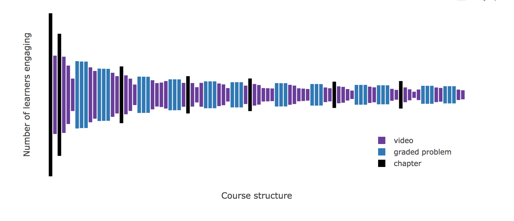

# Deliverables:

The main deliverable for the capstone project is an instructor facing dashboard displaying student and course statistics. Currently, EdX provides a dashboard for instructors in which they are able to view basic statistics such as:

* Basic student demographics including location, gender, educational background, etc.
* Student performance on assignments and quizzes
* Video engagement (Percent of students completing each video)
* Etc.

The main focus of the capstone project will be to create an improved dashboard based on feedback received from instructors. From preliminary meetings with the capstone partners, the main requested features and statistics that instructors are interested in include:

* Course structure
* Student engagement
* Student performance
* Demographics

In order to address these concerns, we plan on constructing an interactive dashboard which provides the requested features. In the following sections, a strategy for implementing these requested features is described.

#### Course structure:

Surprisingly, instructors often do not have an accurate sense on how their course is structured. For example, they don't know how elements are present in their courses such as the number of videos, quizzes, or assignments. From instructor feedback, this is something that they are interested in as well as knowing how many students are interacting with these elements. As an example of what instructors are looking for, the capstone partners have already prototyped an "Eiffel Tower" plot demonstrating course structure to instructors:

The figure above shows a plot able to convey both course structure and student engagement. Since this plot is generally well received by instructors, it has been decided to include a very similar plot into our version of the dashboard. Additionally we plan on interactivity between this plot in which the instructors will be able to highlight students of different demographics. This is discussed further in the demographics section below.

#### Student engagement:

Another request from instructors is to have a better level of detail on how students are engaging with their course elements. For example, instructors are often interested in the popularity of their videos, and currently, the EdX dashboard has a visualization depicting this. However, a common criticism about it is that there is a high amount of "drill down" or times they have to click in order to view the statistics of a single video. For example, an instructor would need to select a specific module of their course, then a specific section within the module, then they would able to select a specific video. One solution for dealing with this problem is to show instructors statistics of the videos that are "out of the ordinary". For example, we could show instructors videos that are the most and least popular. Additionally, we would like to highlight "interesting" videos such as videos being rewatched the most by returning users or highlight specific segments of videos that students often return to.

Additionally, instructors are concerned with how students are engaging with the forum. Instructors want know which topics their students are struggling with, commenting on, or asking questions about. In order to address this issue, we plan on carrying out some form of topic modelling in which the forum data can be summarized visually on the dashboard.  

#### Student performance:

Naturally, instructors are interested on how their students are performing. For example, instructors want to know which assignments or quiz questions their students are having the easiest or most difficult time with. As a result from this desire, we plan on showing the instructors assignments or quiz questions with the highest and lowest success rate. Again, instructors have indicated that they do not want to do too much "drilling down" and would rather be presented with results that are the most "out of ordinary".

#### Demographics:

Lastly, instructors are interested in what kind of students are enrolling in their courses. More specifically, they are interested in the following:

* Language
* Geographic location
* Academic background
* Learning type (Example: Students that watch videos only vs students that do assignments only)
* Expected learning outcomes (Example: Students that are auditing the course vs students that paying and seeking a certificate)

Instructors are interested in comparing the engagement and performance levels between the demographics. For example, an instructor may want to compare how students who have paid for the course are performing on a quiz versus students who are auditing the course. In order to address this issue, it is planned to have a side bar control panel in which the user can select a specific demographic to be highlighted within the rest of the figures described in the pervious sections.

Overall, the deliverable described above is achievable within the given time frame and allows for room for creativity and ingenuity.
