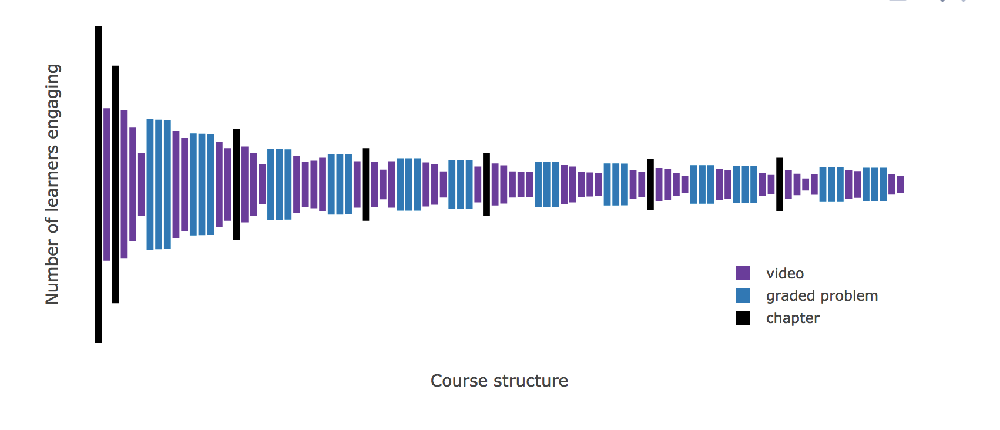
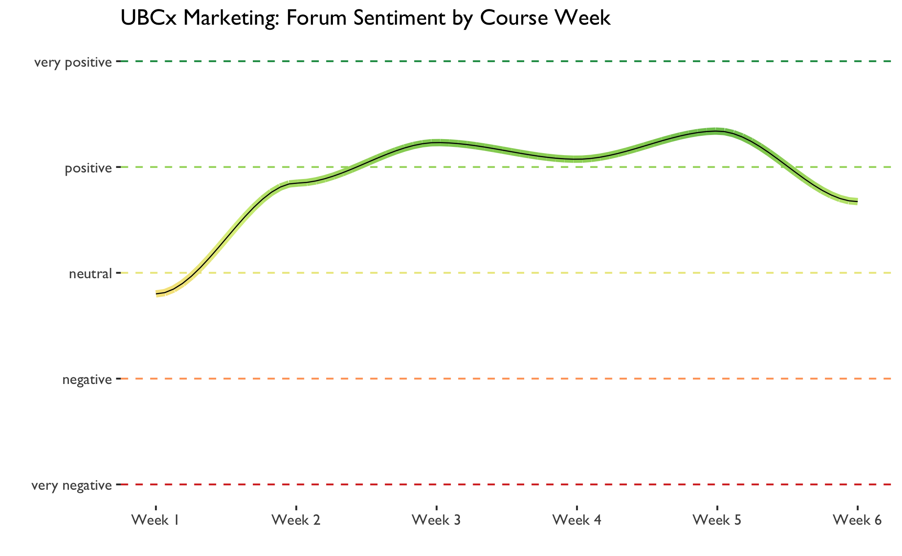

Master of Data Science Capstone Proposal: UBC Centre for Teaching, Learning and Technology
================
Matthew Emery, David Laing, Andrew Lim, and Subi Zhang
5 May 2017

Executive Summary
-----------------

Hundreds of thousands of students worldwide are enrolled in UBC's many massive open online courses (MOOCs). These MOOCs generate huge amounts of data, much of which could be used to help instructors understand how students are interacting with their courses. However, many instructors feel that the existing instructor-facing dashboards are underutilizing the available data. So, for our capstone project, we are proposing to build an improved instructor-facing dashboard. It will help instructors to discover patterns across the structures of their courses, with a special focus on course elements that are beneficial or detrimental to students' learning.

While we have access to much of the appropriate data, and while we are well versed in the tools and techniques needed to complete the project, we will face some challenges. Namely, we may struggle to make the dashboard generalizable across courses with different structures and needs, and we may have too little time for thorough user testing. However, having identified our primary goals, potential risks, mitigation strategies, and project milestones, we believe we are well prepared to deliver an improved instructor-facing dashboard.

Availability of appropriate data
--------------------------------

Most of the appropriate data is stored in Google BigQuery as structured tables, which we can access using SQL. However, we will face three main challenges:

-   The available data varies from course to course. This will make it challenging to build a dashboard that can be generalized to all courses.
-   The data is poorly documented; variable descriptions are often missing. We will need to improve this.
-   Some of the event data is stored in JSON log documents, so we may need to develop a data cleaning pipeline.

Identification of risks and mitigation strategies
-------------------------------------------------

To identify possible risks, we did a [pre-mortem](https://en.wikipedia.org/wiki/Pre-mortem): we envisioned a future in which the project failed, and reflected on the reasons why this may have happened. We identified the following risks:

-   We wait too long before attempting to generalize the dashboard to multiple courses.
-   We wait too long before attempting to scale the dashboard to the full dataset.
-   We don't decide early on which tool to commit to (e.g. Shiny, d3, etc), and end up wasting time fixing bugs with the wrong tool.
-   Shiny is too slow to load all the data.
-   We use too many visualizations in the dashboard, causing visual overload.
-   The product is undeployable, perhaps because of privacy restrictions.
-   The users don’t understand our visualizations.
-   The UI is unintuitive.
-   We have issues accessing the data automatically.
-   Our visualizations/metrics don’t reflect student engagement.
-   Critical information is stuck in a bad format.
-   We underestimate the difficulty of non-visualization tasks.
-   Our visualizations are misleading, because our assumptions are not shared by the instructors.
-   We wait too long before beginning user testing.
-   We don’t comment our code well enough, so it is hard to integrate everything in the final project.
-   We don’t set weekly deadlines.
-   We waste too much time in meetings.
-   We make something that works, but it don't improve upon the two existing dashboards (CTLT and edX).

We came up with mitigation strategies:

-   Set weekly deadlines as a team, and stick to them.
-   Set up user testing sessions as early as possible.
-   Attempt to generalize the dashboard as early as possible.
-   Communicate regularly with the CTLT team and the MOOC instructors to get their feedback on our dashboard versions.
-   Keep track of important tasks using Trello, a task management system.
-   Comment our code as clearly as possible, especially when working on sub-tasks as individuals.

Deliverables
------------

The main deliverable for the capstone project is an instructor-facing dashboard displaying student and course statistics. Currently, edX provides a dashboard which shows the following statistics:

-   Basic student demographics including location, gender, and educational background.
-   Student performance on assignments and quizzes.
-   Video engagement (percent of students completing each video).

The main focus of the capstone project will be to create an improved dashboard based on feedback received from instructors. From preliminary meetings with the capstone partners, we have learned that instructors are most interested in the following:

-   Course structure
-   Student engagement
-   Student performance
-   Demographics

Strategies for implementing these features are described below.

### Course structure

Surprisingly, instructors rarely have an accurate sense of how their courses are structured. For example, they don't know how many videos, quizzes, or assignments are present in each module. From instructor feedback, we know that this is something that they are interested in. They also want to know how many students are interacting with each course element. The CTLT team has developed a prototype of a visualization that shows both course structure and student engagement:

This plot is generally well received by instructors, so we will include a similar plot in our version of the dashboard. We will also add interactivity to help instructors understand how engagement varies across different demographic groups.

### Student engagement

Another request from instructors is to have more details on how students are engaging with their course elements. For example, instructors are often interested in the popularity of their videos. The current edX dashboard shows this, but a common criticism is that it requires too much drilling down; users often have to click multiple times to view the statistics of a single video, and there is little guidance for identifying videos worthy of special attention. One simple solution would be to show instructors videos that are the most and least watched. We would also like to highlight videos or sections of videos that students often return to after leaving the course.

Instructors are also concerned with how students are engaging with the discussion forum. This is an area where we could add a lot of value, since neither the edX dashboard or the CTLT dashboard currently displays any information about the forums. Instructors want know which topics their students are struggling with, commenting on, or asking questions about. They may also want to know whether the topics in the discussion forum match the intended topics for each module of the course, as well as the general sentiment of the discussions across course weeks. Below is a prototype of a visualization we have developed, which shows forum sentiment across course weeks for UBCx's introductory marketing course:

### Student performance

Naturally, instructors are interested in how their students are performing. For example, instructors want to know which assignments or quiz questions their students are struggling with. We plan to show the instructors assignments or quiz questions with the highest and lowest success rate. Again, instructors have indicated that they do not want to do too much drilling down and would rather be presented with results that are most worthy of attention.

### Demographics

Lastly, instructors want to know who is enrolled in their courses. Specifically, they are interested in the following:

-   Language
-   Geographic location
-   Academic background
-   Learner type (e.g. students who only watch videos vs. students who only do assignments)
-   Learning goals (e.g. students who are auditing the course vs. students who are paying and seeking a certificate)

Instructors are interested in comparing engagement and performance levels across demographics. For example, an instructor may want to compare how students who have paid for the course are performing on a quiz versus students who are auditing the course. To address this issue, we will have some form of linked views, or perhaps scented widgets, to allow instructors to select demographic subsets and modify the visualizations described in the sections above.

Timeline
--------

<table>
<colgroup>
<col width="8%" />
<col width="8%" />
<col width="16%" />
<col width="66%" />
</colgroup>
<thead>
<tr class="header">
<th>Start</th>
<th>Stop</th>
<th>Title</th>
<th>Description</th>
</tr>
</thead>
<tbody>
<tr class="odd">
<td>2017-05-04</td>
<td>2017-05-11</td>
<td>MVP</td>
<td>Finish the Marketing course MVP</td>
</tr>
<tr class="even">
<td>2017-05-11</td>
<td>2017-05-25</td>
<td>Generalized MVP</td>
<td>Ensure that the MVP works for for other courses (Climate Change- Programming- China- Creative Writing)</td>
</tr>
<tr class="odd">
<td>2017-05-25</td>
<td>2017-06-08</td>
<td>User Testing</td>
<td>Connect with the administrators of each course and get their feedback for changes</td>
</tr>
<tr class="even">
<td>2017-06-08</td>
<td>2017-06-15</td>
<td>Deployment</td>
<td>Migrate the code from the GitHub repository to an external server</td>
</tr>
<tr class="odd">
<td>2017-06-15</td>
<td>2017-06-22</td>
<td>Post-deployment tweaks</td>
<td>Polish the product before a presentation</td>
</tr>
<tr class="even">
<td>2017-06-22</td>
<td>2017-06-26</td>
<td>Report and Presentation</td>
<td>Write up everything</td>
</tr>
</tbody>
</table>

MVP Assessment
--------------

Te following is a list of metrics and qualities by which our MVP may be assessed:

-   Generalizability and scalability
-   Robustness and maintainability of code base
-   Quality of documentation
-   Coherence of design
-   Adherence to relevant best practices in visualization:
    -   Responsiveness
    -   Prioritization of function over form and aesthetics
    -   Selection of a colour scheme which accommodates colour blindness
    -   Provision of an overview of the data which allows the user to obtain details on demand through interactivity
-   Ability to answer instructors' key questions:
    -   How are my students performing?
    -   How are my students engaging with my course?
    -   What is the overall structure of my course?
    -   How can I change my course to be better?

Time permitting, it may also be useful to consider two additional additional metrics:

-   Scores in a satisfaction survey from instructors
-   Amount of dashboard web traffic from instructors

References
----------

-   Munzner, T. (2017). Lectures 7-8: Networks, Rules of Thumb \[PowerPoint slides\]. Retrieved from <https://github.ubc.ca/ubc-mds-2016/DSCI_531_viz-1_students/blob/master/lectures/lect7-8.pdf>.
-   Pre-mortem. (n.d.) In *Wikipedia*. Retrieved May 5, 2017, from <https://en.wikipedia.org/wiki/Pre-mortem>.
